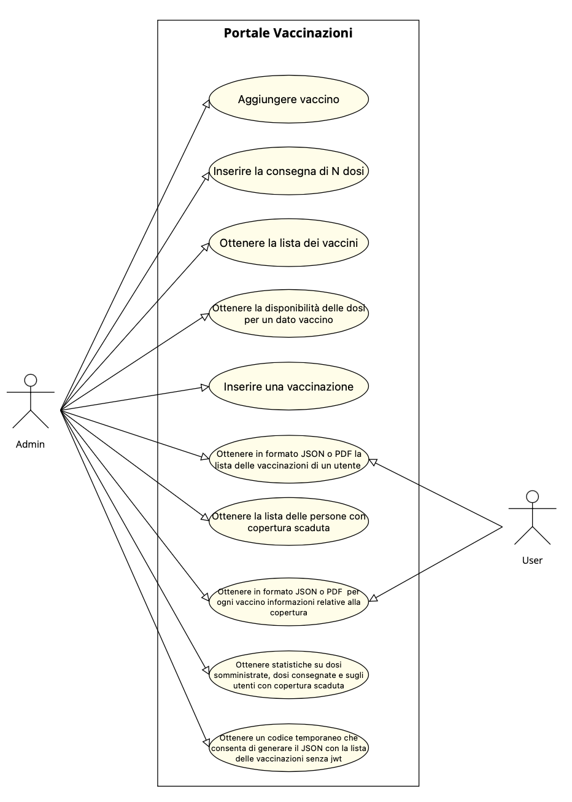
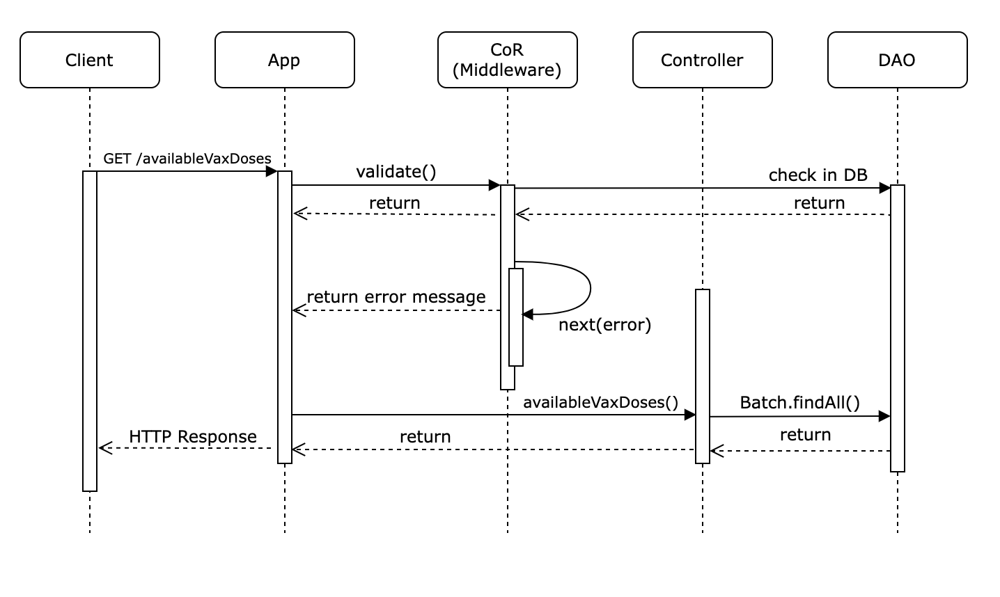
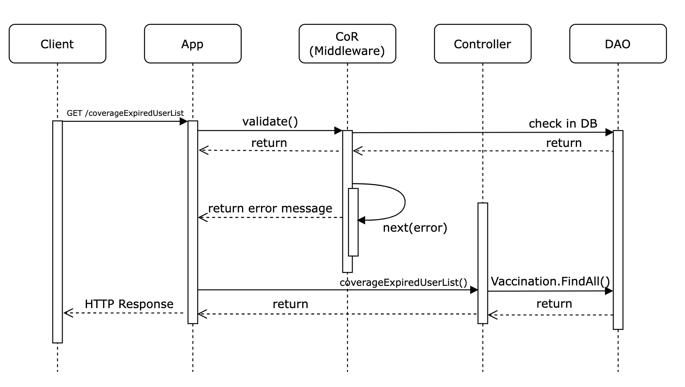

# Progetto Programmazione Avanzata: Gestione Vaccinazioni


## Obiettivo del progetto
L'obiettivo del progetto consiste nella realizzazione di un servizio di back-end per la gestione delle vaccinazioni.
Il sistema deve consentire di gestire l’invio da parte di un operatore autorizzato dell’avvenuta vaccinazione di un individuo.
L'accesso al servizio deve avvenire tramite autenticazione JWT e ad ogni individuo deve essere associato un ruolo: admin o user semplice.
In particolare, il servizio ha lo scopo di implementare le seguenti funzionalità.


|     Funzionalità  	| Ruolo |
| ------------- | ------------- |
| Aggiungere un nuovo vaccino  | admin |
| Inserire la consegna di N dosi di vaccino  |  admin |
| Ottenere la lista dei vaccini filtrata per nome vaccino, disponibilità e scadenza  | admin |
|Ottenere informazioni sulle dosi disponibili per un dato vaccino | admin  |
| Inserire una vaccinazione per un dato utente  | admin  |
| Scaricare un PDF che contenga tutte le vaccinazioni effettuate da uno specifico utente  | admin/user  |
| Ottenere in formato JSON la lista delle vaccinazioni effettuate da uno specifico utente dando la possibilità di filtrare per nome vaccino e/o data di somministrazione   | admin/user  |
| Ottenere la lista delle persone che hanno la copertura scaduta con eventuali filtri su nome vaccino e numero di giorni di copertura scaduta  | admin |
| Ottenere in formato JSON o PDF l'elenco per ogni vaccino fatto per un dato utente il numero di giorni che mancano alla mancata copertura o il numero giorni trascorsi dalla fine della copertura | admin/user  |
| Ottenere delle statistiche sulle dosi somministrate, sulle dosi consegnate e sugli utenti con copertura scaduta| admin |
|Ottenere un codice univoco con durata N minuti per un dato utente che consenta di generare il JSON con la lista delle vaccinazioni effettuate da uno specifico| admin|


## Diagrammi UML
### Diagramma dei casi d'uso

### Diagramma delle sequenze
#### Aggiungere un vaccino


#### Aggiungere dosi consegnate


#### Visualizzare lista vaccini


#### Ricevere informazioni sulla disponibilità dei vaccini


#### Aggiungere una vaccinazione


#### Scaricare un PDF con la lista delle vaccinazioni di un dato utente


#### Ottenere un file JSON con la lista delle vaccinazioni di un dato utente


#### Ottenere la lista delle persone con copertura scaduta


#### Per un dato utente ottenere per ogni vaccino informazioni circa la fine della copertura


#### Ottenere statistiche sulle dosi somministrate, sulle dosi consegnate e sugli utenti scoperti


#### Ottenere chiave REDIS temporanea per la rotta /vaccinationsJson


## Richieste
#tabella rotte - get post - autenticazione (samu)
### /addVax
### /vaxList


## Pattern utilizzati
### Singleton
### DAO
### Factory Method
### Model - Controller
### Chain of Responsability

## Avvio del progetto
> Per poter eseguire il progetto è necessario avere installato [Docker](https://www.docker.com) sulla propria macchina.

Per procedere con l'esecuzione del progetto effettuare i seguenti passaggi:

 - Clonare la repository di progetto
 ```
git clone https://github.com/SuperCappa98/Progetto-Programmazione-Avanzata-Gestione-Vaccinazioni
```
- Creare un file ".env" all'interno della directory di progetto con i seguenti dati:
 ```
 SECRET_KEY=projectsecretkey
PGUSER=userpg
PGDATABASE=vaccinationsdb
PGHOST=dbpg
PGPASSWORD=passwordpg
PGPORT=5432
REDISHOST=redis
REDISPORT=6379
```
- Da terminale posizionarsi nella directory clonata
```
cd https://github.com/SuperCappa98/Progetto-Programmazione-Avanzata-Gestione-Vaccinazioni
 ```
 - Avviare i servizi tramite docker con i seguenti comandi:
 ```
 docker-compose build
 docker-compose up
 ```

## Test
Per l'esecuzione dei test è necessario importare il file [Test-Collection-Vaccinations.postman_collection.json](https://github.com/SuperCappa98/Progetto-Programmazione-Avanzata-Gestione-Vaccinazioni/blob/main/Test-Collection-Vaccinations.postman_collection.json) nel programma [Postman](https://www.postman.com).

I token JWT utilizzati per i test sono stati generati utilizzando  [JWT.IO](https://jwt.io/) con la chiave _projectsecretkey_.


## Librerie/Framework
 - [Node.JS ](https://nodejs.org/en/)
 - [Express](https://expressjs.com)
 - [Sequelize](https://sequelize.org)
 - [Postgres](https://www.postgresql.org)
 - [PDFKit](https://pdfkit.org)
 - [REDIS](https://redis.io)


## Autori

 - [Burini Lisa ](https://github.com/lisaburini)
 - [Cappanera Simone](https://github.com/SuperCappa98)
