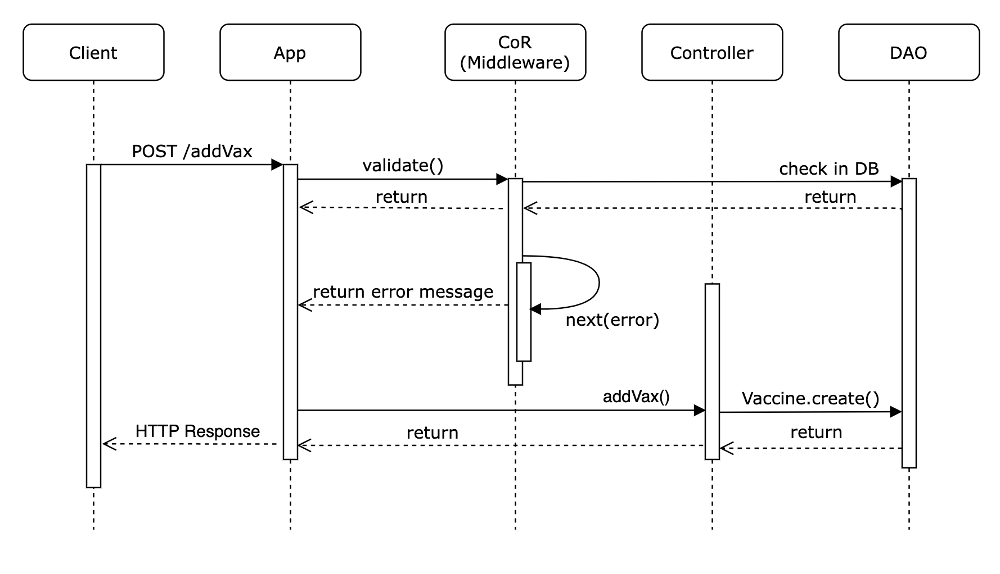
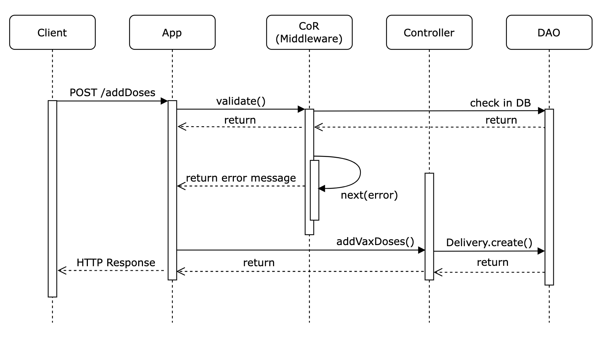
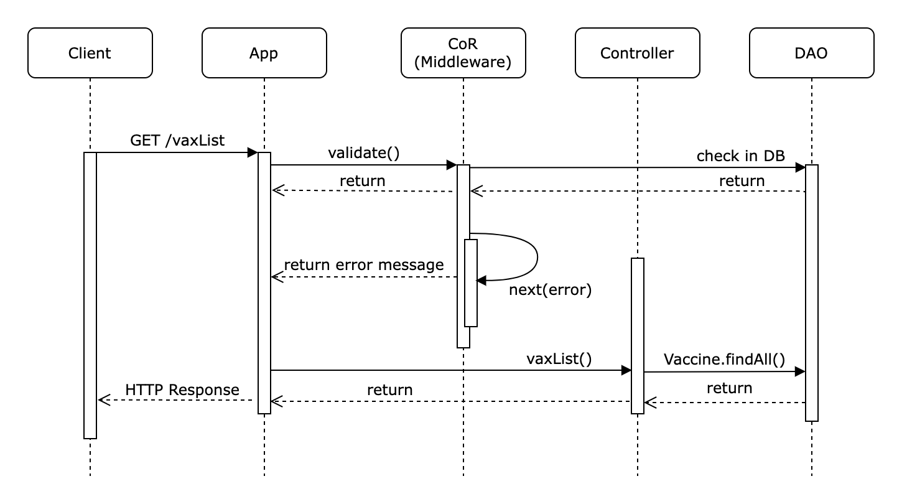
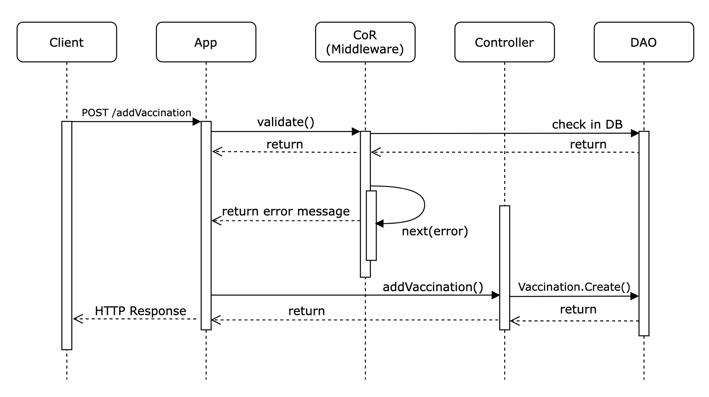
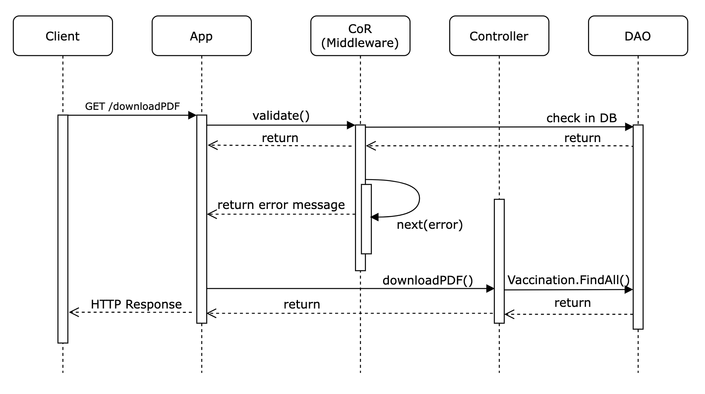
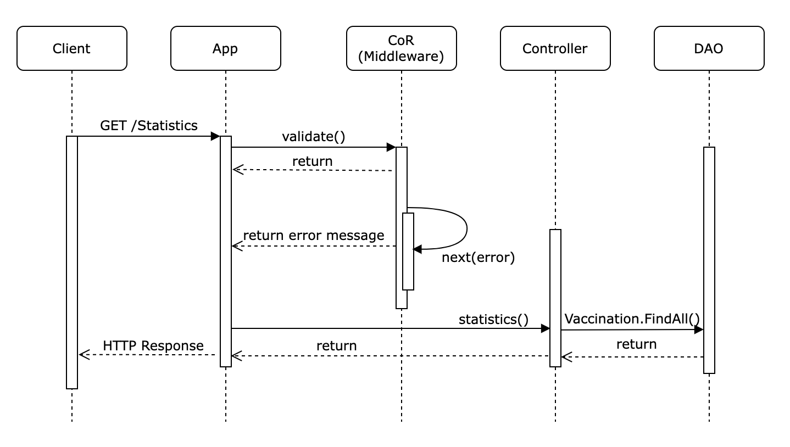
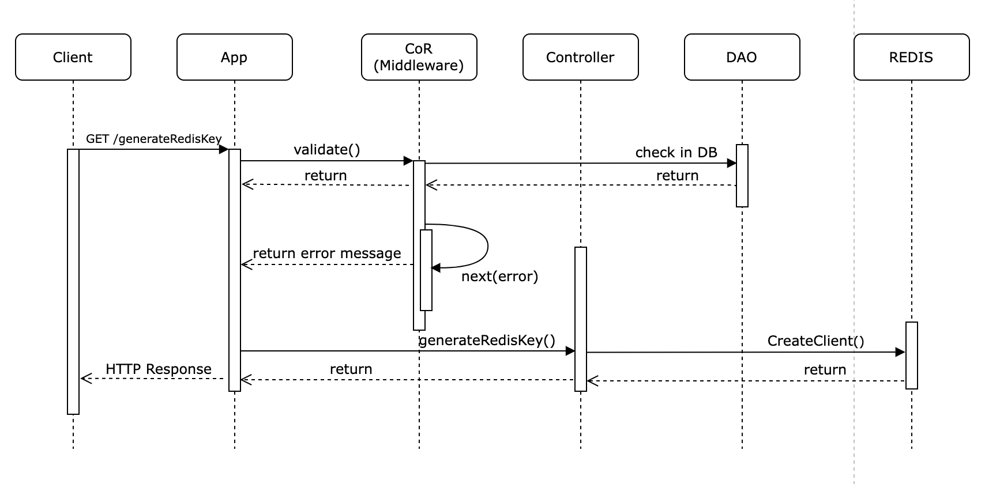

# Progetto Programmazione Avanzata: Gestione Vaccinazioni


## Obiettivo del progetto
L'obiettivo del progetto consiste nella realizzazione di un servizio di back-end per la gestione delle vaccinazioni.
Il sistema deve consentire di gestire l’invio da parte di un operatore autorizzato dell’avvenuta vaccinazione di un individuo.
L'accesso al servizio deve avvenire tramite autenticazione JWT e ad ogni individuo deve essere associato un ruolo: admin o user semplice.
In particolare, il servizio ha lo scopo di implementare le seguenti funzionalità.


|     Funzionalità  	| Ruolo |
| ------------- | ------------- |
| Aggiungere un nuovo vaccino  | admin |
| Inserire la consegna di N dosi di vaccino  |  admin |
| Ottenere la lista dei vaccini filtrata per nome vaccino, disponibilità e scadenza  | admin |
|Ottenere informazioni sulle dosi disponibili per un dato vaccino | admin  |
| Inserire una vaccinazione per un dato utente  | admin  |
| Scaricare un PDF che contenga tutte le vaccinazioni effettuate da uno specifico utente  | admin/user  |
| Ottenere in formato JSON la lista delle vaccinazioni effettuate da uno specifico utente dando la possibilità di filtrare per nome vaccino e/o data di somministrazione   | admin/user  |
| Ottenere la lista delle persone che hanno la copertura scaduta con eventuali filtri su nome vaccino e numero di giorni di copertura scaduta  | admin |
| Ottenere in formato JSON o PDF il numero di giorni che mancano alla mancata copertura o il numero giorni trascorsi dalla fine della copertura per ogni vaccino fatto da uno specifico utente| admin/user  |
| Ottenere delle statistiche sulle dosi somministrate, sulle dosi consegnate e sugli utenti con copertura scaduta| admin |
|Ottenere un codice univoco con durata N minuti per un dato utente che consenta di generare il JSON con la lista delle vaccinazioni effettuate da uno specifico| admin|


## Diagrammi UML
### Diagramma dei casi d'uso

### Diagramma delle sequenze
#### Aggiungere un vaccino


#### Aggiungere dosi consegnate


#### Visualizzare lista vaccini


#### Ricevere informazioni sulla disponibilità di un dato vaccino


#### Aggiungere una vaccinazione


#### Scaricare un PDF con la lista delle vaccinazioni di un dato utente


#### Ottenere un file JSON con la lista delle vaccinazioni di un dato utente


#### Ottenere la lista delle persone con copertura scaduta


#### Per un dato utente ottenere per ogni vaccino informazioni circa la fine della copertura


#### Ottenere statistiche sulle dosi somministrate, sulle dosi consegnate e sugli utenti scoperti


#### Ottenere chiave REDIS temporanea per la rotta /vaccinationsJson


## Richieste
|Rotta| Tipo |Ruolo| Autenticazione JWT	|
| ------------- | ------------- |------------- | ------------- |
| /addVax | POST |	admin | sì |
| /addDoses | POST | admin | sì |
| /vaxList | GET |	admin | sì |
| /availableVaxDoses | GET | admin | sì |
| /addVaccination | POST |	admin | sì |
| /downloadPDF | GET |	admin/user | sì |
| /vaccinationsJson (base) | GET |	admin/user | sì |
| /vaccinationsJson (REDIS) | GET |	user | no |
| /coverageExpiredUserList | GET |	admin | sì |
| /coverageDataUser | GET |	admin/user | sì |
| /statistics | GET |	admin | sì |
| /generateRedisKey | GET |	admin | sì |

## Descrizione delle rotte

In questo paragrafo vengono descritte nel dettaglio tutte le rotte utilizzate nel progetto. Tutti i raw data inviati dall'utente vengono validati nel middleware controllando i relativi tipi e le relazioni che intercorrono tra di essi (ad esempio la data di scadenza di un lotto di un determinato vaccino deve essere maggiore della data di consegna del lotto stesso). Inoltre, si controlla la presenza o meno di certi dati nel database PostgreSQL ove necessario (ad esempio se dobbiamo filtrare tramite il nome di un vaccino, quel vaccino deve essere presente nel database).

### 1) /addVax

Rotta per aggiungere una nuovo vaccinazione al database con i relativi dati, ossia il nome e la sua copertura. 

Il payload deve essere inserito nel body della richiesta in formato JSON secondo questa struttura:
 ```
{
	"vaxName": "NewVax",
	"coverage": 180
}
```

### 2) /addDoses

Rotta per inserire la consegna di N dosi di vaccino nel database con i relativi dati, ossia il numero di dosi consegnate per l'appunto, il lotto di appartenenza, la data di consegna, la data di scadenza del lotto e l'id del vaccino consegnato.

Uno step importante nei controlli di questa rotta consiste nella verifica dell'esistenza del lotto, infatti in questo caso le dosi consegnate andranno sommate a quelle presenti in precedenza nel lotto, altrimenti verrà direttamente creato un nuovo lotto del vaccino con le dosi consegnate. 

Il payload deve essere inserito nel body della richiesta in formato JSON secondo questa struttura:
 ```
{
	"delivery_doses": 500,
	"batch": "CDE7845",
	"delivery_date": "2022-04-26",
	"expiration_date": "2022-12-15",
	"vaccine_id": 1
}
```

### 3) /vaxList

Rotta per visualizzare la lista di tutti i vaccini presenti nel database, dando la possibilità di filtrare per:

 - Nome vaccini (può essere singolo o multiplo);
 - Disponibilità (maggiore o minore di un dato valore oppure compreso tra due valori in questo caso inclusi);
 - Scadenza (maggiore o minore di una certa data oppure compresa tra due date in questo caso incluse).

Il payload deve essere inserito nel body della richiesta in formato JSON secondo questa struttura:
```
{
	"vax_name": ["vaxzevria", "comirnaty"],
	"availability": [200, 1500],
	"expiration_date": ["2022-12-15", "2024-06-26"]
}
```

### 4) /availableVaxDoses

Rotta per avere informazioni sulla disponibilità di un dato vaccino, dando la possibilità di filtrare per:

 - Disponibilità (maggiore o minore di un dato valore oppure compreso tra due valori in questo caso inclusi).

Il payload deve essere inserito nel body della richiesta in formato JSON secondo questa struttura:
```
{
	"vax_name": "Spikevax",
	"availability": [60, null]
}
```

### 5) /addVaccination

Rotta per inserire una vaccinazione effettuata da uno specifico utente nel database con i relativi dati, ossia il vaccino utilizzato, il lotto di cui fa parte il vaccino, il codice fiscale dell'utente e la data della vaccinazione in formato timestamp. 

Tra i vari controlli effettuati in questa rotta, particolare importanza hanno quelli sui casi di inserimenti non validi, ovvero il caso in cui l'utente non sia presente nel database, quello in cui il lotto del vaccino indicato non sia valido, il caso in cui il vaccino che si vuole utilizzare sia scaduto e infine quello in cui la copertura vaccinale non sia ancora scaduta e si voglia quindi effettuare una vaccinazione anticipata.

Il payload deve essere inserito nel body della richiesta in formato JSON secondo questa struttura:
```
{
	"user_key": "RGNGNN86E53F839L",
	"vaccine_id": 2,
	"batch": "SC2606",
	"timestamp_vc": "2022-07-05 13:42:25"
}
```

### 6) /downloadPDF

Rotta per scaricare un PDF che contenga tutte le vaccinazioni effettuate da uno specifico utente. 

Essendo questa una rotta che può essere richiamata sia da un admin che da un utente, nel caso venga eseguita da un admin il codice fiscale dello specifico utente sarà nel payload JSON del token JWT dell'admin insieme a quello di quest'ultimo, mentre nel caso venga eseguita da un utente verrà estratto direttamente il suo codice fiscale dal token JWT essendo l'unico presente. Quindi dovrà essere fatto questo controllo a monte nel token JWT. 

### 7) /vaccinationsJson

Rotta per ottenere in formato JSON la lista delle vaccinazioni effettuate da uno specifico utente, dando la possibilità di filtrare per:

 - Nome vaccino;
 - Data di vaccinazione.

Quest'ultima può essere maggiore o minore di una certa data oppure compresa tra due date in questo caso incluse.

Essendo anche questa una rotta che può essere richiamata sia da un admin che da un utente, vale lo stesso discorso fatto nella rotta "/downloadPDF".

Inoltre, questa rotta può essere eseguita da un utente anche senza autenticazione JWT, se esso fornisce un codice univoco di durata temporanea ottenuto in precedenza.

Se si vuole eseguire la rotta normalmente, il payload deve essere inserito nel body della richiesta in formato JSON secondo questa struttura:
```
{
	"vax_name": "VAXZEVRIA",
	"vaccination_date": [null, "2019-06-01"]
}
```
Altrimenti, se si vuole richiamarla tramite il metodo con il codice univoco di durata temporanea, il payload deve essere inserito nel body della richiesta in formato JSON secondo questa struttura:
```
{
	"redis_key":"1657509442535",
	"vax_name": "Comirnaty",
	"vaccination_date": [null, "2019-06-01"]
}
```

### 8) /coverageExpiredUserList

Rotta per visualizzare la lista delle persone che hanno la copertura scaduta, dando la possibilità di filtrare per:

 - Nome vaccino;
 - Numero di giorni della copertura scaduta.
 
Quest'ultima può essere maggiore o minore di un dato valore, ma comunque il valore deve essere maggiore di zero, oppure compreso tra due valori in questo caso inclusi.

Il payload deve essere inserito nel body della richiesta in formato JSON secondo questa struttura:
```
{
	"vax_name": "spikevax",
	"days_coverage_expired": [100, 1000]
}
```

### 9) /coverageDataUser

Rotta per restituire in formato JSON o PDF il numero di giorni che mancano alla scadenza della copertura vaccinale o il numero di giorni trascorsi dalla fine della suddetta copertura per ogni vaccino fatto da un determinato utente. Inoltre, si ha la possibilità di ordinare il numero di giorni in modo crescente o decrescente.

Nella richiesta deve essere specificato il formato di uscita dei dati sulla copertura dell'utente tra JSON e PDF.

Il payload deve essere inserito nel body della richiesta in formato JSON secondo questa struttura:
```
{
	"format": "PDF",
	"order_by": "DESC"
}
```

### 10) /statistics 

Rotta per ottenere delle statistiche sulle dosi somministrate, sulle dosi consegnate e sugli utenti con copertura scaduta. In particolare, per ogni vaccino e per ogni mese, ignorando però l'anno preciso, si vuole vedere il minimo, il massimo, la media e la deviazione standard delle dosi somministrate e il numero medio di dosi consegnate. Inoltre, si vuole sapere il numero di utenti con copertura scaduta entro 30 giorni, tra 31 e 90 giorni e oltre i 90 giorni.

### 11) /generateRedisKey

Rotta per generare un codice univoco di durata temporanea per un dato utente che consenta poi di ottenere in formato JSON la lista delle vaccinazioni effettuate da quello specifico utente senza autenticazione JWT.

Il payload deve essere inserito nel body della richiesta in formato JSON secondo questa struttura:
```
{
	"user_key": "GTTNDR80A03A271U",
	"name": "Andrea",
	"surname": "Gatti"
}
```


## Pattern utilizzati
### Singleton
Il Singleton è un design pattern creazionale che ci assicura un'unica istanza di una certa classe, garantendo però l'accesso globale ad una determinata istanza.
Il costruttore di default è privato, per prevenire l'uso dell'operatore "New" associato alla classe Singleton.
In questa classe si definisce un metodo statico che funge da costruttore: quando richiamato l'oggetto verrà creato solamente in assenza di un'ulteriore istanza.
Abbiamo utilizzato questo pattern per definire la connessione con il database, al fine di garantirne l'unicità.

### DAO
Il Data Access Object è un pattern architetturale utile per l'astrazione dei dati persistenti.
Il DAO ci permette di isolare lo strato della logica di applicazione dallo strato di persistenza dei dati tramite un meccanismo di astrazione.
Questa interfaccia nasconde all'applicazione la complessità delle operazioni CRUD del sottostante meccanismo di storage, permettendo ad entrambi gli strati di evolvere separatamente senza conoscere nulla l'uno dell'altro.
Disaccoppiare lo strato di logica dallo strato dei dati persitenti permette di essere molto più flessibili nella scelta del meccanismo di storage, il quale potrà facilmente essere cambiato in futuro.
Abbiamo, quindi, utilizzato questo pattern al fine di rendere la nostra applicazione più flessibile e manutenibile nel tempo. 

### Factory Method
Il Factory Method è un design pattern creazionale che fornisce un'interfaccia per la creazione di oggetti in una super classe, ma permette alle sottoclassi di alterare il tipo di oggetti che saranno creati. Si usa quindi l'interfaccia per istanziare oggetti diversi.
Abbiamo utilizzato questo pattern per la generazione dei messaggi di errore e di successo da ritornare al client.

### Model - Controller
Il pattern architetturale comunemente conosciuto è il Model View Controller: essendo il nostro progetto improntato sullo sviluppo di un back-end, la componente di View non può essere implementata.
Utilizzando questo pattern abbiamo suddiviso il sistema in due componenti logiche in grado di interagire fra di loro.
Il componente Model gestisce i dati e le operazioni su quest'ultimi, mentre il Controller gestisce l'interazione con l'utente. Lo scopo è rendere il codice più strutturato possibile.

### Chain of Responsability
La Chain of Responsability è un design pattern comportamentale che permette di far passare la richiesta lungo una catena di handlers.
E' necessario implementare un pattern di questo tipo al crescere della complessità dell'applicazione, infatti più saranno i controlli che devono esser fatti sulle richieste e più il codice sarebbe confusionario e duplicato senza un meccanisco di handler in serie.
Ogni handler prende la richiesta come argomento ed ha un riferimento all'handler successivo: se il controllo non va a buon fine l'handler restituirà un errore, altrimenti passerà la richiesta all'handler seguente. 
Nel nostro progetto se la richiesta riesce ad attraversare tutti i middleware di una determinata catena, verrà a quel punto elaborata dal controller.

## Avvio del progetto
> Per poter eseguire il progetto è necessario avere installato [Docker](https://www.docker.com) sulla propria macchina.

Per procedere con l'esecuzione del progetto effettuare i seguenti passaggi:

 - Clonare la repository di progetto
 ```
git clone https://github.com/SuperCappa98/Progetto-Programmazione-Avanzata-Gestione-Vaccinazioni
```
- Creare un file ".env" all'interno della directory di progetto con i seguenti dati:
 ```
SECRET_KEY=projectsecretkey
PGUSER=userpg
PGDATABASE=vaccinationsdb
PGHOST=dbpg
PGPASSWORD=passwordpg
PGPORT=5432
REDISHOST=redis
REDISPORT=6379
```
- Da terminale posizionarsi nella directory clonata
```
cd https://github.com/SuperCappa98/Progetto-Programmazione-Avanzata-Gestione-Vaccinazioni
 ```
 - Avviare i servizi tramite Docker con i seguenti comandi:
 ```
 docker-compose build
 docker-compose up
 ```

## Test
Per l'esecuzione dei test è necessario importare il file [Test-Collection-Vaccinations.postman_collection.json](https://github.com/SuperCappa98/Progetto-Programmazione-Avanzata-Gestione-Vaccinazioni/blob/main/Test-Collection-Vaccinations.postman_collection.json) nel programma [Postman](https://www.postman.com).

I token JWT utilizzati per i test sono stati generati utilizzando  [JWT.IO](https://jwt.io/) con la chiave _projectsecretkey_.


## Librerie/Framework
 - [Node.JS ](https://nodejs.org/en/)
 - [Express](https://expressjs.com)
 - [Sequelize](https://sequelize.org)
 - [Postgres](https://www.postgresql.org)
 - [PDFKit](https://pdfkit.org)
 - [REDIS](https://redis.io)


## Autori

 - [Burini Lisa ](https://github.com/lisaburini)
 - [Cappanera Simone](https://github.com/SuperCappa98)
